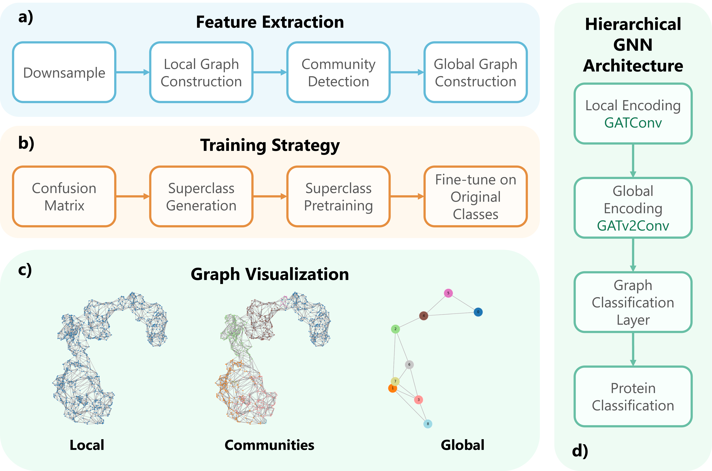

# **ProtoCluster**



## 🧬 Pipeline

This pipeline processes `.vtk`-based structural biology datasets, trains a multi-stage graph neural network (GNN) model, and performs test-time inference to generate predictions suitable for submission.

---

## 📖 Overview

The pipeline is structured in modular stages:

1. **Installation**: Setup environment and dependencies.
2. **Data Preparation**: Download and extract `.tar.gz` files containing `.vtk` files.
3. **Stage 1 - Confusion Analysis**: Initial training with error diagnosis.
4. **Stage 2 - Pretraining**: Retraining using relabeled examples.
5. **Stage 3 - Finetuning**: Final training stage using pretrained weights.
6. **Inference (Submission)**: Run inference on test data with fully trained weights.

---

## ⚙️ Installation

**macOS / Linux**

```bash
python -m venv .venv
source .venv/bin/activate
pip install -r requirements.txt
```

**Windows**

```bash
python -m venv .venv
.venv\Scripts\activate
pip install -r requirements.txt
```

---

## 📦 Data Download

Download example `.vtk` datasets using the provided helper script. On Windows, use **Git Bash** to execute it:

```bash
sh scripts/download_data.sh
```

---

## 🚀 Full Training Pipeline

By default:
- `DATA_PATH = ./sample_data`
- `OUTPUT_PATH = ./output`

To run the full multi-stage pipeline:

```bash
sh scripts/pipeline.sh
```

For experiments on the full dataset, replace `./sample_data` with your full dataset path (e.g., `./data`).

---

## 🧪 Inference Only (Trained Weights)

If you have trained models already (e.g., trained on the full dataset), you can skip training and run inference directly:

```bash
sh scripts/inference.sh
```

This uses pretrained weights located in `./weights/`, including:

- `local_gcn_weights_stage_3.pth`
- `global_gcn_weights_stage_3.pth`

These are expected to be trained on the **entire training dataset**, not the sample. The script:
- Preprocesses the test data.
- Runs inference using the final GNN.
- Saves predictions to `output/submission.csv`.

---

## 📊 Results on Test Set

The final model was evaluated on the held-out test set, achieving the following results:

| Metric             | Score    |
|--------------------|----------|
| Accuracy           | 0.71090  |
| Balanced Accuracy  | 0.40483  |
| F1-Score           | 0.66623  |
| Recall             | 0.71090  |
| Precision          | 0.69556  |

## Citation
```
@article{Yacoub2025,
  title = {Shrec 2025: Protein Surface Shape Retrieval Including Electrostatic Potential},
  url = {http://dx.doi.org/10.2139/ssrn.5258950},
  DOI = {10.2139/ssrn.5258950},
  publisher = {Elsevier BV},
  author = {Yacoub,  Taher and Depenveiller,  Camille and Tatsuma,  Atsushi and Barisin,  Tin and Rusakov,  Eugen and G\"{o}bel,  Udo and Peng,  Yuxu and Deng,  Shiqiang and Kagaya,  Yuki and Park,  Joon Hong and Kihara,  Daisuke and Guerra,  Marco and Palmieri,  Giorgio and Ranieri,  Andrea and Fugacci,  Ulderico and Biasotti,  Silvia and He,  Ruiwen and Benhabiles,  Halim and Cabani,  Adnane and Hammoudi,  Karim and Li,  Haotian and Huang,  Hao and Li,  Chunyan and Tehrani,  Alireza and Meng,  Fanwang and Heidar-Zadeh,  Farnaz and Yang,  Tuan-Anh and Montes,  Matthieu},
  year = {2025}
}
```
